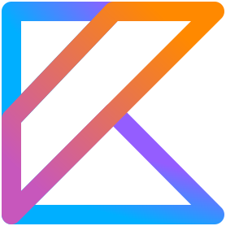

# arrow-examples

### Kotlin + Arrow

Algunos ejemplos sobre __*cómo ser más felices*__ evitando lanzar excepciones...

---

Sobre Kotlin:
- Kotlin es un lenguaje de programación creado por JetBrains en 2012. Que presenta como característica ser 100% interoperable con Java
- Lenguaje oficial Android
- Presenta múltiples syntactic sugars que posibilitan un desarrollo más agil
- Posee un set de funciones para manejo de listas más completo e intuitivo que el de Java

Sobre Arrow-Kt:
- Es una *biblioteca* para programación funcional tipada en Kotlin
- Nos provee de DataTypes (Either, Validated, Nel, Option, entre otros)
- Nos provee de TypeClasses, Effects (para el manejo de side-effects), y Optics (abstracciones para actualizar de manera funcional y elegante objetos inmutables)

