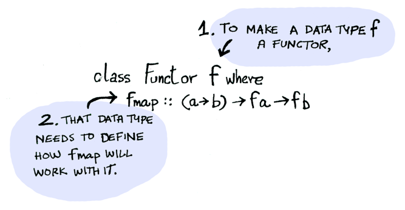
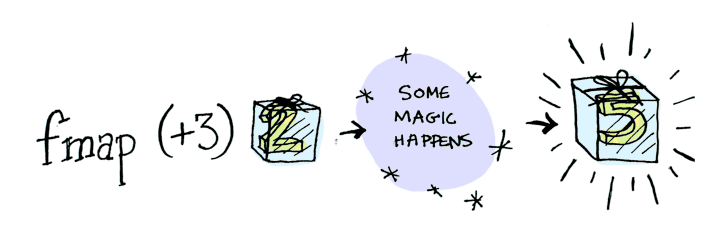

# Functor

## Qué es un Funtor?


_**El diccionario lo define como**_ un objeto que implementa y/o define la función `.map`

```
fun F<A>.map(f: (A) -> B): F<B>
```



- Algunos ejemplos de Funtores son: List, Option e Either.

## De qué nos sirve un Funtor?
Cuando un valor está envuelto en un objeto/estructura no podemos aplicar una función sobre él como lo haríamos normalmente...


Y los Funtores existen para operar en estas situaciones...




## Map
La definición de `.map` debe seguir 2 (dos) reglas:

### 1. Identidad

Si recibe como parámetro la función `identidad` en input debe ser igual al output.


### 2. Composición

Si se componen 2 (dos) o más funciones y se pasan como parámetro a `.map` el resultado debe ser el mismo que si se componen múltiples llamadas a `.map`, una con cada función.


## Resumen
Funtor es una interfaz. Entonces, si definimos la función `.map` cumpliendo las reglas mencionadas en un objeto, tendremos un objeto mappeable, una instancia de funtor.

## Fuentes
1. [Your easy guide to Monads, Applicatives, & Functors](https://medium.com/@lettier/your-easy-guide-to-monads-applicatives-functors-862048d61610)
2. [Functors, Applicatives, And Monads In Pictures](https://adit.io/posts/2013-04-17-functors,_applicatives,_and_monads_in_pictures.html#:~:text=A%20functor%20is%20a%20data,an%20applicative%2C%20and%20a%20monad)

