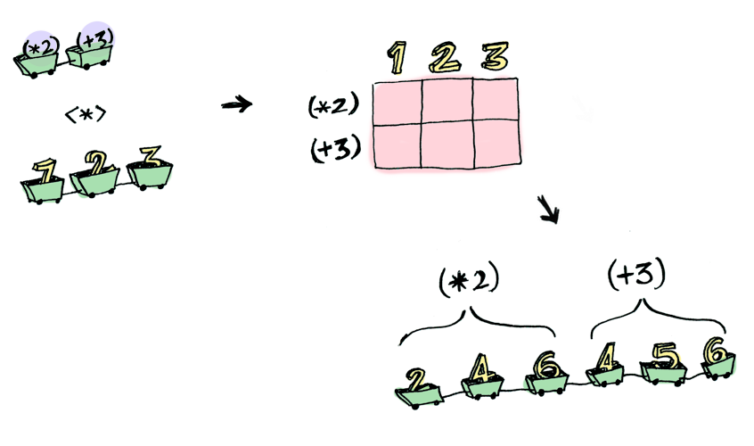

# Applicative

## Qué es un Applicative?

Qué pasa cuando no sólo nuestros valores están envueltos en una estructura...


Sino también nuestras funciones...


_**Los Applicatives van un paso más allá que los Functores**_ y nos permiten operar en estos casos.

Es decir, mientras que un funtor permite la aplicación de una función pura a un valor en un contexto, un Applicative permite la aplicación de una función en un contexto a un valor en un contexto.



Para ello, definen la función `.apply` (`<*>`) y la función `.just` o `.pure` :

```
fun <A, B> Kind<F, A>.apply(ff: Kind<F, (A) -> B>): Kind<F, B>
```

```
fun <A> just(a: A): Kind<F, A>
```

**Nótese el parecido entre `.apply` y nuestro ya conocido `.map`**

## Fuentes
1. [Your easy guide to Monads, Applicatives, & Functors](https://medium.com/@lettier/your-easy-guide-to-monads-applicatives-functors-862048d61610)
2. [Functors, Applicatives, And Monads In Pictures](https://adit.io/posts/2013-04-17-functors,_applicatives,_and_monads_in_pictures.html#:~:text=A%20functor%20is%20a%20data,an%20applicative%2C%20and%20a%20monad)

