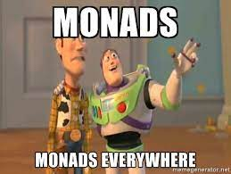
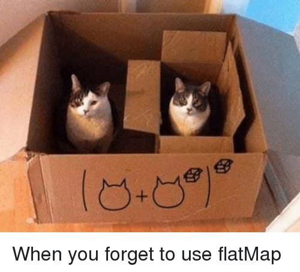

# Monad

## Qué es una Mónada?



Hasta ahora sabemos lo siguiente:
- Los Funtores aplican funciones a valores encapsulados en un contexto.
- Los Applicatives aplican funciones en un contexto a valores en un contexto.

Las mónadas, entonces, aplican funciones a valores encapsulados en un contexto que devuelven valores encapsulados en un contexto

### Entonces cómo hacemos para evitar anidar contextos?

Las mónadas definen la función `.flatmap`

```
fun F<A>.flatmap(f: (A) -> F<B>): F<B>
```



## Fuentes
1. [Your easy guide to Monads, Applicatives, & Functors](https://medium.com/@lettier/your-easy-guide-to-monads-applicatives-functors-862048d61610)
2. [Functors, Applicatives, And Monads In Pictures](https://adit.io/posts/2013-04-17-functors,_applicatives,_and_monads_in_pictures.html#:~:text=A%20functor%20is%20a%20data,an%20applicative%2C%20and%20a%20monad)

